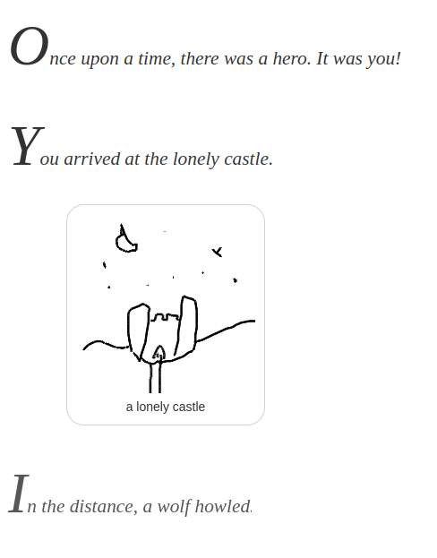

Hack-A-Day is a project I'm doing in November, where I try to make 30 new projects, in 30 days.

# Day 28: Hack-An-Adventure

Day 28 is a guided "coloring book" style adventure.

Demo available [here](https://tilde.za3k.com/hackaday/adventure).

Source available on [github](https://github.com/za3k/day28_adventure).
